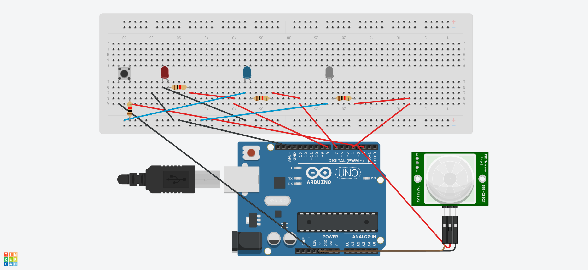

# MotionDetectionWithPIR

## Overview
**MotionDetectionWithPIR** is an Arduino-based project that utilizes a Passive Infrared (PIR) sensor to detect motion and activate LEDs accordingly. This project can be used for security systems, automation, or motion-triggered events.

## Components Required
- Arduino board (Uno)
- PIR Motion Sensor
- Red LED
- Blue LED
- White LED
- Push Button
- Resistors (as needed)
- Wires
- Breadboard

## How It Works
1. The PIR sensor detects motion within its range.
2. A push button is used to enable or disable the motion detection system.
3. LEDs indicate the system's status:
   - **White LED** signals that the system is calibrated and ready.
   - **Red LED** turns on when the button is pressed to activate motion detection.
   - **Blue LED** blinks when motion is detected.